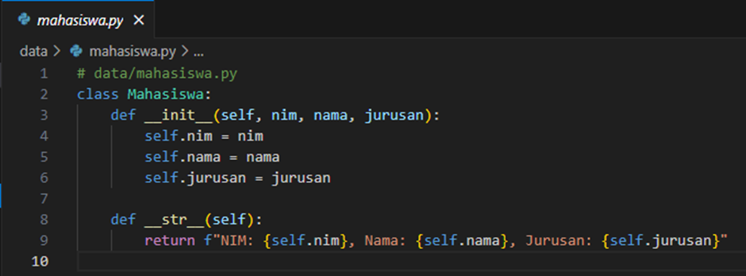
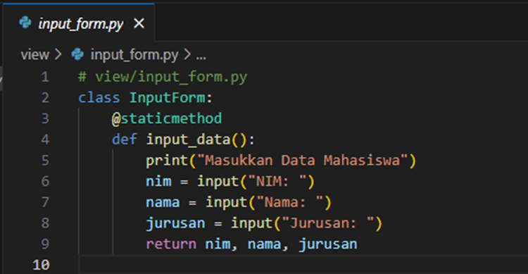
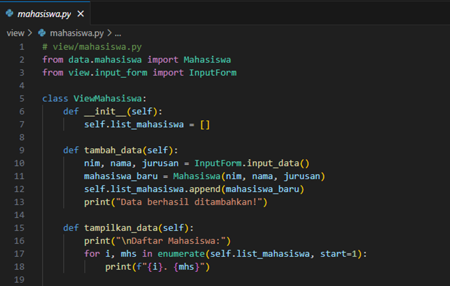
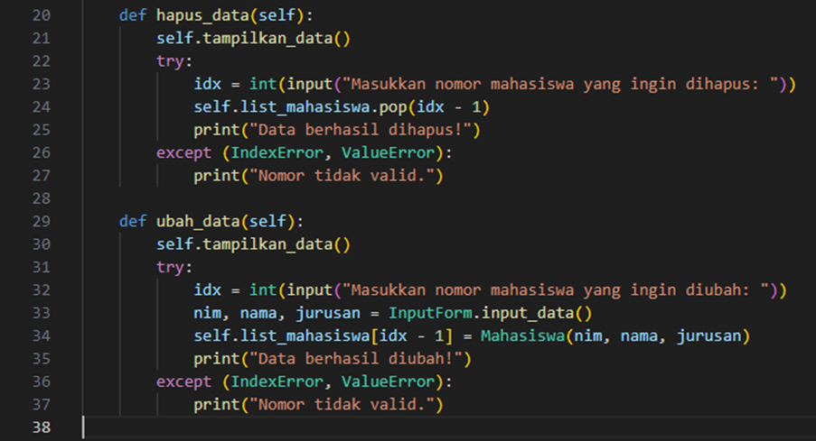
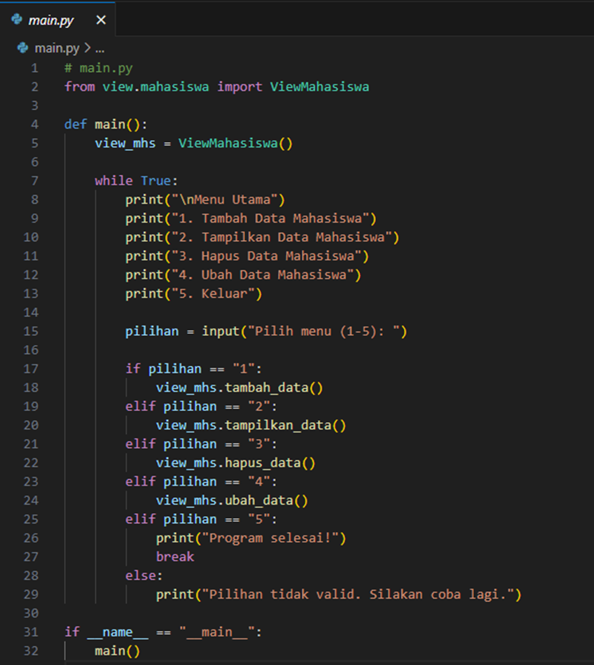
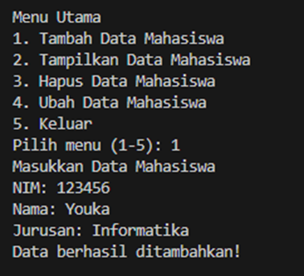
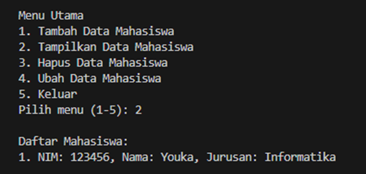
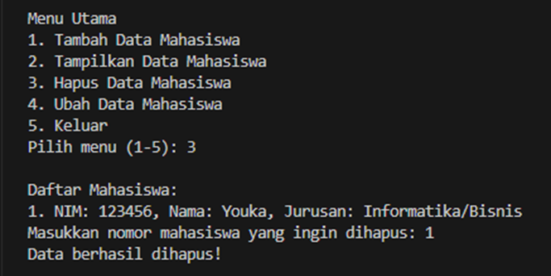
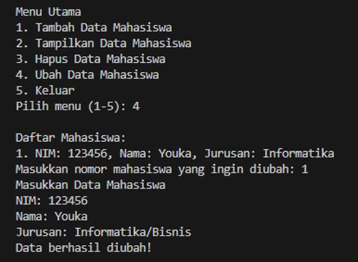

# Membuat Program dengan Object-Oriented Programming (OOP) 

### Struktur Program
* Program dari Object-Oriented Programming (OOP) yang terdiri dari package dan modul:
     1.	Package:
         * data: Berisi definisi class Mahasiswa untuk menyimpan data mahasiswa.
         * view: Berisi:
             - class InputForm untuk input data mahasiswa.
             - class ViewMahasiswa untuk menampilkan, menambahkan, menghapus, dan mengubah data mahasiswa.
     2.	Program Utama (main.py):
         * Menampilkan menu utama dan memproses pilihan pengguna.

### Penjelasan Modul

1.	**File:** data/mahasiswa.py

     **Contoh kode program Python3 (Vs Code)**

     
 
     **Penjelasan:**
     * **Class Mahasiswa:**
         - Class ini adalah **model** untuk data mahasiswa.
         - **__init__:** Konstruktor yang menerima tiga parameter (nim, nama, jurusan) dan menyimpannya sebagai atribut.
         - **__str__:** Method khusus untuk mengembalikan representasi string dari objek Mahasiswa. Ini berguna ketika kita mencetak objek mahasiswa menggunakan print.

2.	**File:** view/input_form.py

     
 
     **Penjelasan:**
     * **Class InputForm:**
         - Bertanggung jawab untuk meminta input dari pengguna.
         - Method **input_data:**
             - **@staticmethod:** Method ini tidak memerlukan objek dari class untuk dipanggil.
             - Mengambil input NIM, Nama, dan Jurusan dari pengguna.
             - Mengembalikan data input tersebut dalam bentuk tuple (nim, nama, jurusan).

3.	**File:** view/mahasiswa.py

     
     

     **Penjelasan:**
     * **Class ViewMahasiswa:**
         - Mengatur semua operasi terkait mahasiswa: menambahkan, menampilkan, menghapus, dan mengubah data mahasiswa.
     * **Atribut:**
         - list_mahasiswa: List kosong yang menyimpan objek Mahasiswa.
     * **Method:**
         1.	**tambah_data:**
             - Mengambil input menggunakan InputForm.input_data.
             - Membuat objek Mahasiswa baru dan menambahkannya ke dalam list_mahasiswa.
         2.	**tampilkan_data:**
             - Menampilkan semua data mahasiswa yang ada dalam list.
         3.	**hapus_data:**
             - Menampilkan daftar mahasiswa.
             - Meminta pengguna memilih data mahasiswa yang ingin dihapus.
             - Menghapus data berdasarkan indeks.
         4.	**ubah_data:**
             - Menampilkan daftar mahasiswa.
             - Meminta pengguna memilih data mahasiswa yang ingin diubah.
             - Memperbarui data mahasiswa dengan input baru.

4.	**File:** main.py

     

     **Penjelasan:**
     * Program utama menggunakan ViewMahasiswa untuk memanggil fungsi-fungsi:
         1.	**Tambah Data Mahasiswa**
         2.	**Tampilkan Data Mahasiswa**
         3.	**Hapus Data Mahasiswa**
         4.	**Ubah Data Mahasiswa**
     * Program menampilkan **menu utama** dengan perulangan while sampai pengguna memilih **Keluar (5).**
     * Setiap menu memanggil method dari class ViewMahasiswa.

### Contoh Penggunaan
1.	Menambahkan Data

     

2. Menampilkan Data

     

3.	Menghapus Data

     

4.	Mengubah Data

      
